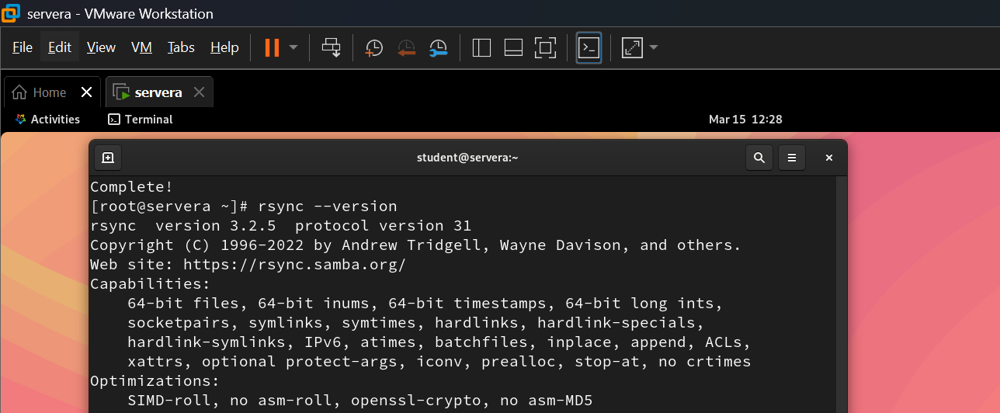
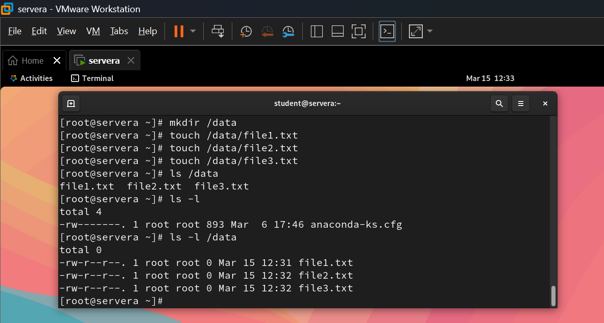
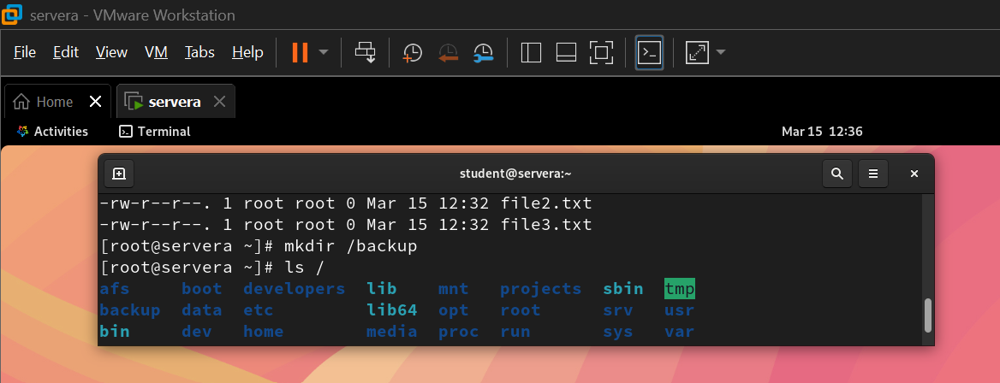
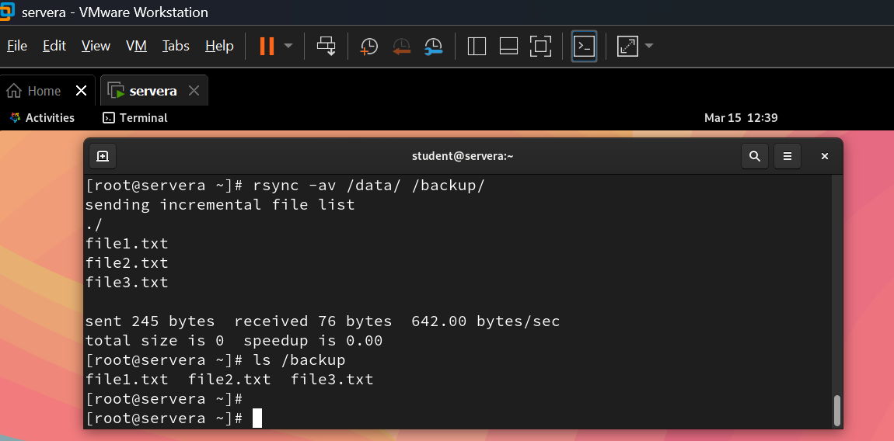
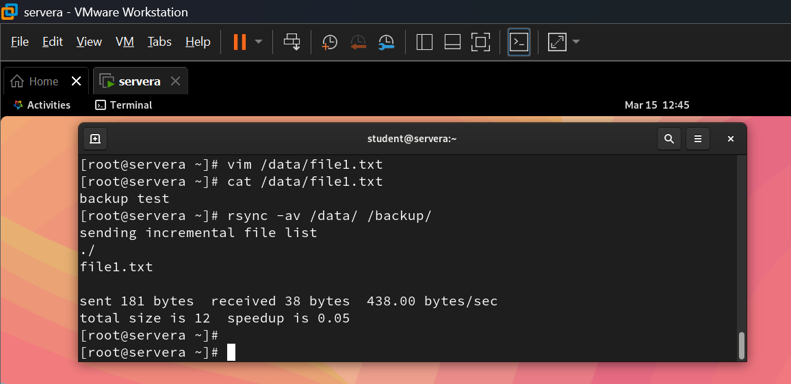
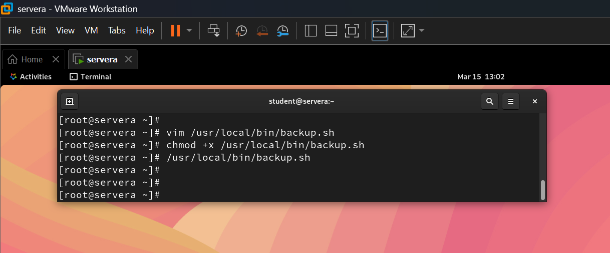
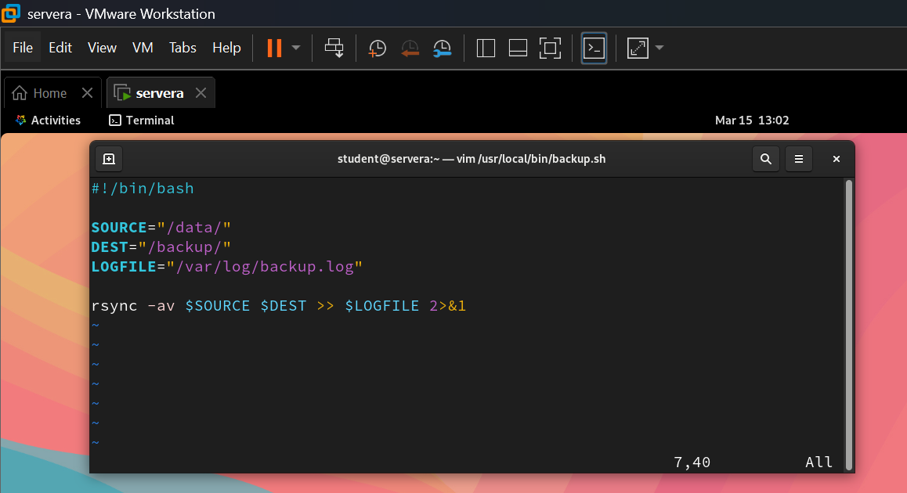
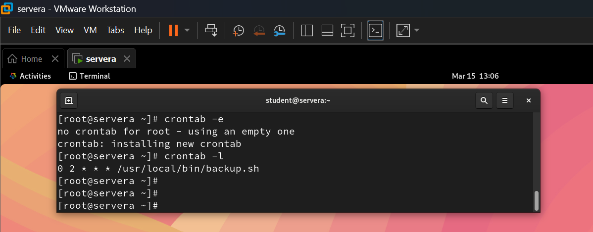
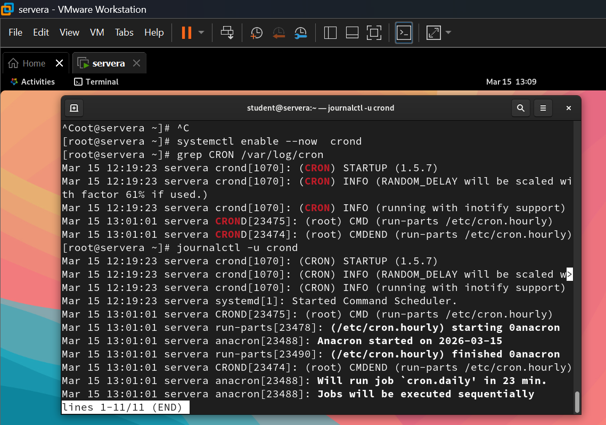

# Linux Backup Automation (rsync + cron)

## Overview

This project demonstrates how to automate file backups in Linux using **rsync** and **cron** on **AlmaLinux**.
The system performs scheduled backups from a source directory to a backup directory and records the activity in a log file.

---

## Architecture

```
/data  →  rsync  →  /backup
                 ↓
              backup.log

cron → runs backup.sh automatically
```
---

## Technologies

- AlmaLinux
- Bash scripting

## Tools

- rsync
- cron
- GitHub

---

## Step 1: Install rsync

Check if rsync is installed:

```bash
rsync --version
```

Install if required:

```bash
dnf install rsync -y
```

---

## Step 2: Create Source Directory

```bash
mkdir /data
touch /data/file1.txt
touch /data/file2.txt
touch /data/file3.txt
```

Verify:

```bash
ls /data
```

---

## Step 3: Create Backup Directory

```bash
mkdir /backup
```

---

## Step 4: Perform Manual Backup

```bash
rsync -av /data/ /backup/
```

### Explanation

| Option | Meaning                                          |
| ------ | ------------------------------------------------ |
| -a     | archive mode (preserves permissions, timestamps) |
| -v     | verbose output                                   |


---

## Step 5: Test Incremental Backup

Modify a file:

```bash
vim /data/file1.txt
```

Run rsync again:

```bash
rsync -av /data/ /backup/
```

Only the modified file will be synchronized.


---

## Step 6: Create Backup Script

Create script:

```bash
vim /usr/local/bin/backup.sh
```

Script:

```bash
#!/bin/bash

SOURCE="/data/"
DEST="/backup/"
LOGFILE="/var/log/backup.log"

rsync -av $SOURCE $DEST >> $LOGFILE 2>&1
```

Make executable:

```bash
chmod +x /usr/local/bin/backup.sh
```

Test:

```bash
/usr/local/bin/backup.sh
```


---

## Step 7: Automate Backup with cron

Edit cron:

```bash
crontab -e
```

Add job:

```bash
0 2 * * * /usr/local/bin/backup.sh
```

Meaning:

| Time    | Value |
| ------- | ----- |
| Minute  | 0     |
| Hour    | 2     |
| Day     | *     |
| Month   | *     |
| Weekday | *     |

This runs the backup **daily at 2:00 AM**.

Check cron jobs:

```bash
crontab -l
```

---

## Step 8: Verify Cron Logs

After scheduling the backup job, verify that the cron service is running and check the logs.

### Check Cron Logs using grep

First ensure the cron service is enabled and running.
```bash
systemctl enable --now crond
```
You can filter cron entries from the system log file.

```bash
grep CRON /var/log/cron
```
This command displays cron-related activities recorded in the log.

### Check Cron Logs using journalctl
Another method is using `journalctl` to view logs from the cron service.

```bash
journalctl -u crond
```
This shows detailed logs generated by the cron daemon.


---

## Screenshots

Screenshots are stored in the `screenshots` directory.

---

## Key Features

* Automated backup using cron
* Incremental synchronisation with rsync
* Backup logging for monitoring
* Simple and efficient Linux backup solution

---

## Author

Bibin Mathew  
RHCSA Certified Linux System Administrator

Created as part of Linux administration learning and portfolio development.
